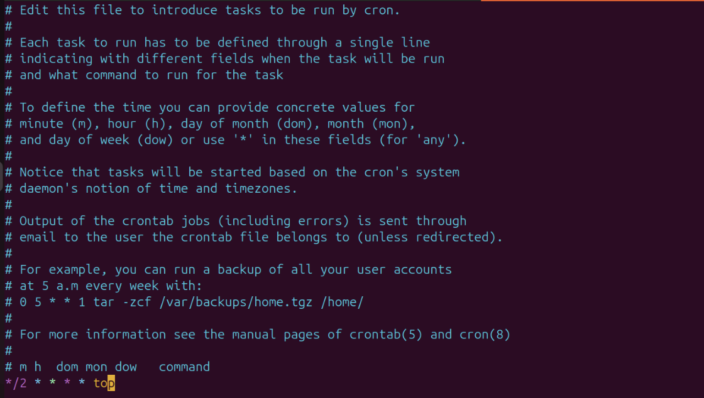
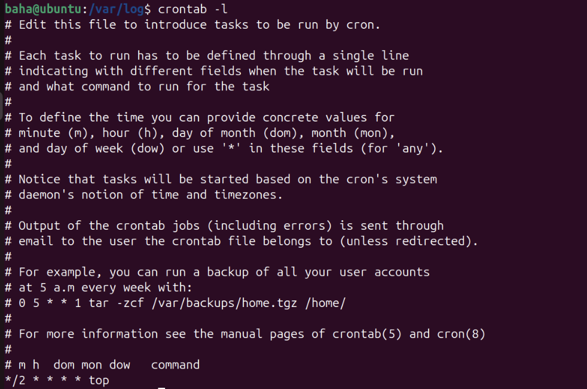
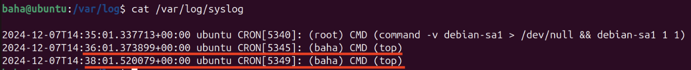
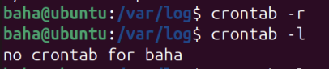
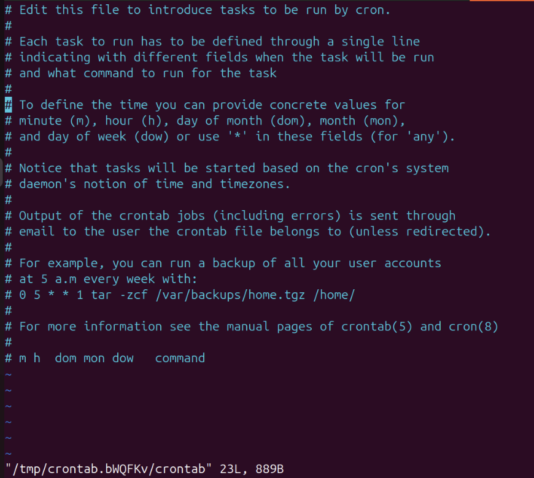

# Лабораторная работа

## Часть 1

Для того чтобы команда `top` выполнялась каждые 2 минуты, прописываем команду `crontab -e` и в открывшимся файле прописываем 
```
*/2 * * * * top
```
сохраняем изменения и выходим из файла.



## Часть 2

Выведем на экран список текущих заданий используя команду .

```
crontab -l
```



## Часть 3
Для того чтобы найти в файле `syslog` две строки о выполнении команды `top` прописываем.
```
cat /var/log/syslog
```



## Часть 4
Удаляем все задания из планировщика заданий используя команду 

```
crontab -r
```





